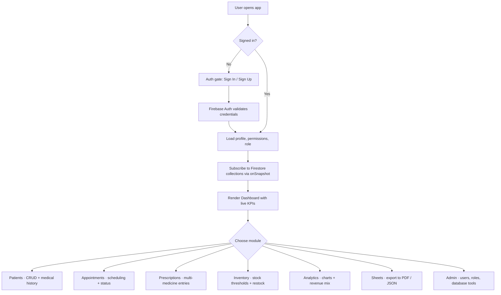
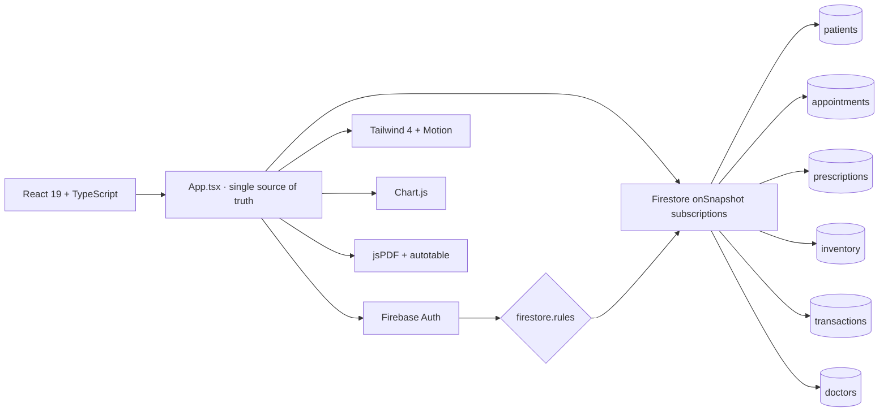

<div align="center">

# 🦷 Khan Dental — Practice Management Platform

### A modern, real-time clinic operations system for dentists who run a serious practice.

Patients, appointments, prescriptions, billing, inventory, and analytics — all in one fluid, glassy, dark-mode-ready React application backed by Firebase.

<br/>

[](https://react.dev)
[](https://www.typescriptlang.org)
[](https://vitejs.dev)
[](https://tailwindcss.com)
[](https://firebase.google.com)
[](https://www.chartjs.org)
[](https://motion.dev)
[](#license)

<br/>

`Real-time Firestore` · `Role-based admin` · `PDF reporting` · `Animated UI` · `Dark mode`

</div>

---

## 📌 Project Snapshot

**Khan Dental** is a full-featured practice management platform built for a real dental clinic. It started as a simple patient list and evolved into a complete operations console with eight integrated modules and a hardened admin layer.

The platform delivers:

- 🩺 **Patient lifecycle management** — registration, medical history, allergies, chronic conditions
- 📅 **Appointment scheduling** with status tracking (Scheduled, Completed, Cancelled)
- 💊 **Digital prescriptions** with multi-medicine dosage, frequency, and duration entries
- 💰 **Billing & installments** — direct payments or weekly installment plans, auto-status reconciliation
- 📦 **Inventory control** — stock thresholds, restocking history, purchase price, supplier company
- 📊 **Analytics dashboard** — revenue, expenses, service mix, patient flow
- 🗂️ **Reportable sheets** — exportable, filterable tables of every collection
- 🛡️ **Admin console** — role-based permissions, user management, database tools

Built on **React 19**, **TypeScript**, **Vite**, **Tailwind v4**, and **Firebase** — with no backend server to maintain.

---

## 🎬 Preview

### Clinical Workflow

- Animated dashboard with live KPI cards (revenue, patients, appointments, low stock)
- One-click patient registration → linked appointment → linked prescription → linked transaction
- Cascade-aware deletes that keep aggregates honest
- Light and dark themes, responsive across mobile and desktop

### Authentication & Access

- Email + password sign-in (Firebase Auth)
- Owner account auto-elevated to admin
- Role-gated tabs — non-admins only see modules they have permission for
- Session-aware UI: refresh-safe, auto-redirects to auth gate when signed out

### Reporting

- One-tap PDF export of patient records, prescriptions, and financial sheets
- Charts powered by `chart.js` with animated transitions
- Exportable JSON dumps per Firestore collection

---

## 🌊 Visual Flow



---

## 🧱 Tech Stack

| Layer            | Tool                                | Purpose                                                       |
| ---------------- | ----------------------------------- | ------------------------------------------------------------- |
| UI Framework     | `React 19`                          | Component model, concurrent rendering, hooks                  |
| Language         | `TypeScript 5.8`                    | Strong typing across data models, props, and Firestore reads  |
| Build Tool       | `Vite 6`                            | Instant HMR, lean production bundles                          |
| Styling          | `Tailwind CSS 4.1`                  | Utility-first design system, dark mode, glass effects         |
| Animation        | `Motion 12`                         | Entry transitions, hover states, layout animations            |
| Icons            | `lucide-react`                      | Consistent, lightweight icon set                              |
| Charts           | `Chart.js 4.5` + `react-chartjs-2`  | Revenue, expense, and service-mix visualisations              |
| PDF              | `jsPDF` + `jspdf-autotable`         | Client-side report generation                                 |
| Date utils       | `date-fns`                          | Appointment scheduling, installment calculations              |
| Backend          | `Firebase 12`                       | Auth + Firestore (real-time database) + hosting-ready         |
| Hosting          | Static host of choice               | Vite build output deploys anywhere (Firebase, Vercel, Netlify)|

---

## 🗂️ Folder Structure

```
med-manager/
├── index.html                  # Entry HTML, app metadata
├── package.json
├── vite.config.ts
├── tsconfig.json
├── firestore.rules             # Server-side security policies
├── firebase-blueprint.json
├── public/
│   └── _redirects              # SPA fallback for static hosts
├── functions/                  # Firebase Cloud Functions (admin-side)
└── src/
    ├── App.tsx                 # Monolithic app — all modules + state
    ├── main.tsx                # React 19 root mount
    ├── firebase.ts             # Firebase init (auth + firestore)
    ├── types.ts                # Patient, Appointment, Prescription, ...
    ├── index.css               # Tailwind v4 entry + custom layers
    └── lib/
        └── utils.ts            # `cn()`, formatters, helpers
```

> Khan Dental is intentionally monolithic in `App.tsx` — every module shares the same Firestore subscription layer and a single `activeTab` state, which keeps cross-module aggregates (revenue, low-stock counts, appointment totals) perfectly in sync.

---

## 🛠️ How This Project Was Built

A practical, end-to-end story of how the platform came together.

### 1. Defined the data model first

Before writing a single component, I designed the Firestore schema. Every entity in `types.ts` exists because the clinic actually tracks it:

- `Patient` — with `serialNo`, billing status, installment plan, and medical history arrays
- `Appointment` — linked to a patient by ID, with service type and status
- `Prescription` — multi-medicine, dosage/frequency/duration per entry
- `InventoryItem` — quantity, threshold, purchase price, supplier company
- `Transaction` — income or expense, optionally tied to a patient or inventory item
- `Doctor` — profile + permissions, keyed by Firebase Auth UID

Getting the schema right early meant every later module just plugged into it.

### 2. Wired Firebase Auth + Firestore

Authentication runs entirely on Firebase. `src/firebase.ts` initialises the app and exports `auth` and `db`. The owner email is hardcoded into `firestore.rules` as the bootstrap admin — every other admin is created from inside the app.

### 3. Built the real-time data layer

Instead of polling, every collection is subscribed via `onSnapshot` in `AppContent`. That means:

- New appointments appear instantly without refresh
- Inventory deductions reflect across the dashboard the moment a transaction is logged
- Multiple staff members can use the app simultaneously without overwriting each other

### 4. Designed the visual system

Tailwind v4 + a custom CSS variable layer drive the look:

- Glassmorphism panels with backdrop blur
- Animated gradient borders on KPI cards
- Smooth dark/light theme toggle with persisted preference
- Motion-powered entry animations on every list and modal
- Lucide icons throughout for a consistent visual language

### 5. Implemented cascade-safe deletes

Firestore has no foreign keys, so deletes are handled in-app:

- Deleting a `patient` removes their `appointments`, `prescriptions`, and `transactions` in a single batch
- Deleting an `inventory item` clears any orphan transactions referencing it
- Deleting your own account purges every collection the user owns

This keeps aggregates (Total Revenue, Active Patients, Low Stock Items) honest at all times.

### 6. Layered in role-based access control

`firestore.rules` defines the source of truth, but the UI also respects per-feature permissions stored on each `doctor` profile. Tabs are filtered by `FeatureKey` — non-admins simply do not see modules they cannot use.

### 7. Added reporting & exports

`jsPDF` + `jspdf-autotable` generate clinic-ready PDFs of:

- Patient records and medical history
- Prescriptions in a print-friendly layout
- Financial sheets (revenue, expenses, installment schedules)

Every collection is also exportable to JSON from the Admin → Database tab.

### 8. Hardened the admin console

The Admin tab gives the owner:

- A user directory with role and status controls
- Database stats, wipe, and export tools
- A live permissions matrix to grant or revoke per-module access

---

## 🏛️ Architecture



---

## ✨ Core Features

### 🩺 Patient Management
- Auto-incrementing `serialNo` per patient
- Medical history, allergies, and chronic conditions as taggable lists
- Direct or installment-based billing with weekly schedules
- Status auto-reconciles between `Paid` and `Unpaid` based on `amountPaid`

### 📅 Appointments
- Per-patient scheduling with date and time
- Service type taken from the canonical `ServiceType` enum (auto-prices the visit)
- Status pipeline: `Scheduled` → `Completed` / `Cancelled`
- One-click conversion of completed appointments into transactions

### 💊 Prescriptions
- Multi-medicine entries — name, dosage, frequency, duration
- Linked to the patient and the prescribing doctor
- Print-friendly PDF export

### 📦 Inventory
- Categories (PPE & Disposables, Medicines, Equipment, ...)
- Per-item minimum threshold with low-stock alerts on the dashboard
- Restock history, purchase price, and supplier company
- Reduce-stock vs delete-entire-item flow when consuming items

### 💰 Transactions & Analytics
- Income and expense ledger
- Optional links to patient or inventory item
- Revenue, expense, and service-mix charts
- Filterable by date range

### 🗂️ Sheets
- Tabular export view for every collection
- One-click PDF and JSON downloads

### 🛡️ Admin
- User accounts (create, disable, delete, role-change)
- Database tools (counts, exports, controlled wipes)
- Per-feature permission matrix

### 🎨 UX & Styling
- Dark and light themes
- Glassmorphic panels and animated KPI cards
- Responsive layout from 360px up to 4K
- Empty states and shimmer loading on every list
- Toast banners for success and error feedback

---

## 🚀 Local Development

### Prerequisites

- `Node.js 20+`
- A Firebase project with Email/Password auth enabled

### Install & run

```bash
git clone https://github.com/jawar001/med-manager.git
cd med-manager
npm install
npm run dev
```

Default URL:

```
http://localhost:5173
```

### Available scripts

```bash
npm run dev       # Start Vite dev server with HMR
npm run build     # Production build to ./dist
npm run preview   # Preview the production build
npm run lint      # Type-check the project (tsc --noEmit)
npm run clean     # Remove the build output
```

---

## 🔐 Firebase Configuration

The app expects a Firebase project with:

1. **Authentication** → Providers → **Email/Password** enabled
2. **Firestore Database** in production mode
3. The rules from `firestore.rules` deployed
4. Your owner email set inside `firestore.rules` (the `isAdmin()` helper)

To point the app at your own Firebase project, edit `src/firebase.ts`:

```ts
const firebaseConfig = {
  apiKey: "YOUR_API_KEY",
  authDomain: "YOUR_PROJECT.firebaseapp.com",
  projectId: "YOUR_PROJECT_ID",
  storageBucket: "YOUR_PROJECT.appspot.com",
  messagingSenderId: "YOUR_SENDER_ID",
  appId: "YOUR_APP_ID",
};
```

### Recommended Firestore rules

```javascript
rules_version = '2';
service cloud.firestore {
  match /databases/{database}/documents {
    function isAuthenticated() {
      return request.auth != null;
    }
    function isAdmin() {
      return isAuthenticated() &&
        (request.auth.token.email == "OWNER_EMAIL" ||
         get(/databases/$(database)/documents/users/$(request.auth.uid)).data.role == 'admin');
    }
    match /{document=**} {
      allow read, write: if isAuthenticated();
    }
  }
}
```

---

## 🗄️ Firestore Collections

| Collection      | Purpose                                          | Key fields                                              |
| --------------- | ------------------------------------------------ | ------------------------------------------------------- |
| `patients`      | Patient records & billing                        | `serialNo`, `name`, `serviceType`, `amountDue`, `status`|
| `appointments`  | Scheduled and historical visits                  | `patientId`, `date`, `time`, `status`                   |
| `prescriptions` | Multi-medicine prescriptions                     | `patientId`, `medicines[]`, `doctorName`                |
| `inventory`     | Stock items                                      | `name`, `quantity`, `minThreshold`, `purchasePrice`     |
| `transactions`  | Income and expense ledger                        | `amount`, `type`, `category`, `patientId?`              |
| `doctors`       | Per-user profile and permissions (keyed by uid)  | `email`, `role`, `permissions`, `disabled`              |

---

## 💡 Why This Project Matters

Khan Dental shows what serious clinic software can look like when built with modern primitives:

- A **single-page React app** that handles seven full modules without becoming a mess
- **Real-time everywhere** — no manual refresh, no polling, no stale stats
- **Cascade-safe data hygiene** in client code, with rules enforcing the perimeter
- **Role-based access** that actually scales beyond the owner
- **Beautiful, animated UI** with no UI library lock-in — every component is custom

It is an end-to-end demonstration of building production-grade software with React, TypeScript, Firebase, and Tailwind in a single, readable codebase.

---

## 🛣️ Roadmap

- [ ] Multi-clinic support with org-level isolation
- [ ] Calendar view for appointments (week / month grid)
- [ ] Patient portal — read-only access to their own records
- [ ] SMS / email reminders via Firebase Functions
- [ ] Image attachments for x-rays and intra-oral photos
- [ ] Audit log of every admin action
- [ ] Offline-first with Firestore persistence
- [ ] Localisation (Bengali + English)

---

## 📜 License

Released under the **MIT License**.

---

<div align="center">

## 👤 Author

**Sahajada Jawar**

[](https://github.com/jawar001)
[](mailto:shahajadajawar@gmail.com)

<br/>

⭐ If this project helped or inspired you, consider starring the repo.

</div>
